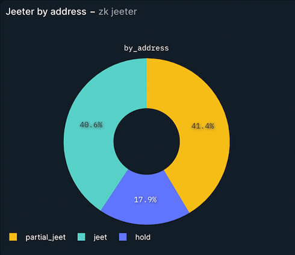

# TOP 3 Strategies for Successful Airdrop Campaigns

## What Is a Cryptocurrency Airdrop?

*A cryptocurrency airdrop is a marketing strategy that involves sending tokens to the wallets of active members of the blockchain community for free or in return for a small service in order to promote awareness and circulation of a new token.  
— Investopedia*

While this description captures the essence of airdrops, it also hints at potential pitfalls. These issues can be divided based on the two main aspects of the description.

## “Sending Tokens for Free or …”

This strategy often attracts participants who are primarily interested in short-term gains, leading to several interrelated problems:

**1. Artificial Activity**

The allure of free tokens often causes a rush of fake activity. People create multiple fake accounts (Sybil attacks) or use other tricks to get more tokens. This false engagement can make it seem like there's more interest in the project than there really is, leading to misleading metrics about community growth and user activity.

**2. Market Dilution**

Because of the prevalence of Sybil users, long-term users who are genuinely interested in the project receive a lower share of the airdrop. When they see on social media that others, who are not genuinely interested and may be using bot farms, have received significantly more tokens, it can be disheartening. This disparity can harm the motivation of real users, causing them to leave the project.

**3. Value Depreciation**

Many recipients, lacking genuine interest in the project, quickly sell off their tokens, causing market oversupply and a subsequent drop in price. This devalues the token, negatively impacting long-term investors and undermining the project's perceived value.

**LayerZero Case**

At the conclusion of LayerZero's airdrop campaign, it was announced that 1.28 million wallets were eligible for the airdrop out of nearly 6 million unique wallet addresses that interacted with LayerZero since its launch. This means that approximately 78.6% of the wallet addresses were identified as Sybil addresses. Additionally, LayerZero required a donation before claiming the airdrop, turning it into more of a sale and not meeting user expectations. These issues, among others, led to about 40% price drop in the first week.

## “Promote a New Token”

The goal of promoting awareness and circulation of a new token often misaligns with what should be promoted. When the airdropped token lacks clear utility or integration within the project’s ecosystem, recipients, even if they are interested in the product, see little reason to hold onto it. This token is merely a "shitcoin," appealing only to short-term speculators. This misalignment fails to incentivize long-term cooperation and engagement, further diminishing the token’s and project's value.

**ZKSync Case**

While the ZK token has utility in theory—being used for transaction fees on the zkSync network—the lack of unique applications on the network diminishes its practical value. Without compelling use cases or applications to drive demand, the token's utility is limited, and users are less likely to find value in holding or using it.

In the first three weeks after the zkSync airdrop, 40.6% of the top 10,000 addresses that received the ZK tokens completely sold them, and 41.4% partially sold their tokens. This created additional selling pressure for up to 16% of all allocated tokens. Consequently, only 17.9% of the recipients are still holding their tokens. This significant sell-off contributed to a 46% price drop, highlighting the harmful impact of this airdrop campaign on the token's value.

## Strategies for Effective Airdrop Campaigns

To address the challenges of traditional airdrop campaigns, projects must adopt more strategic and targeted approaches. Here are some key strategies to enhance the effectiveness of airdrop campaigns:

### 1. Align Airdrops with Product Metrics

Each product has its main metrics that drive success. Each token should have a clear utility tied to these metrics. Airdrop campaigns should be built around these core metrics to ensure that the distribution aligns with the project’s goals. The participation rate should be directly proportional to the airdrop share received. The more a user participates in activities that align with key metrics, the more tokens they receive. This can be effectively managed through a point-based system.

**Example:**  
If a product’s main metric is total value locked (TVL), points can be used to incentivize both the amount and duration of value locked. The more value a user locks, and the longer they lock it, the more points they earn. For fairness, 10 locks of 10 value should be equal in points to 1 lock of 100 value. This ensures users are rewarded for the total value they lock without being incentivized to manipulate the system by making multiple smaller locks. This encourages genuine participation and helps maintain the integrity of the airdrop campaign.

### 2. Avoiding Leverage

Providing additional incentives for specific actions, such as referrals, can be exploited by bots. Instead, ensure that any bonuses are derived from the user’s own points rather than additional incentives. This reduces the likelihood of exploitation and ensures that the referral program genuinely incentivizes finding new, real users.

**Example:**  
Instead of giving an additional 10% in tokens for each referral (which can be exploited), structure it so that referrers receive a percentage of the points earned by the new user. This way, the referrer benefits only if the new user is genuinely active.

### 3. Incentivizing Long-Term Engagement

Structure airdrop rewards to encourage long-term participation. Distributing tokens in phases based on continued involvement or holding periods can keep recipients engaged with the project over a longer term. Be open with your community at the start of the campaign by proposing these phases. This approach can attract users who are genuinely interested in your project and help avoid speculators.

**Example:**  
- **Initial Distribution:** Distribute a portion of the tokens upfront to eligible users.
- **Follow-Up Distributions:** Release additional tokens periodically (e.g., monthly or quarterly) based on continued participation in the platform, such as holding tokens, providing liquidity, or voting in governance proposals.
- **Staking Rewards:** Users who stake their tokens for a specified period can receive bonus tokens or increased voting power in governance decisions.

## Conclusion

Combining these three strategies can transform your airdrop campaign into an effective tool for converting prospects into loyal users, making your airdrop campaign a key component of a broader loyalty system, and gradually building a committed and engaged user base. By aligning airdrops with product metrics, avoiding leverage exploitation, and incentivizing long-term engagement, projects can ensure airdrop campaigns that genuinely support user loyalty and long-term project success. 

And do not forget to effectively describe your airdrop campaign to your community so they understand what they are signing up for. Any misalignment can lead to losing users and reputation.

***Ready to elevate your airdrop campaign? [Book a free consultation with our experts right away!](https://calendly.com/artemfrantsiian-xpirio/30min)***

## Links

1. [Top 10k ZK Claimers](https://query.nansen.ai/public/dashboards/uHhTXjQbXiR6OCB1BXlmOAujStIPCfJdPleAknZa?org_slug=default)
